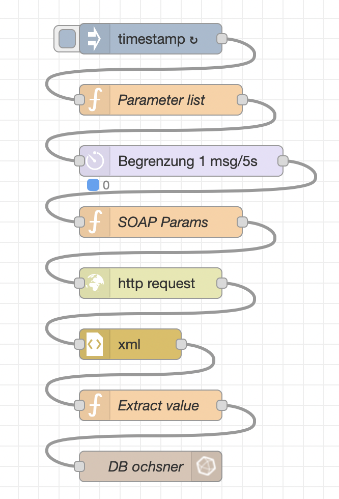
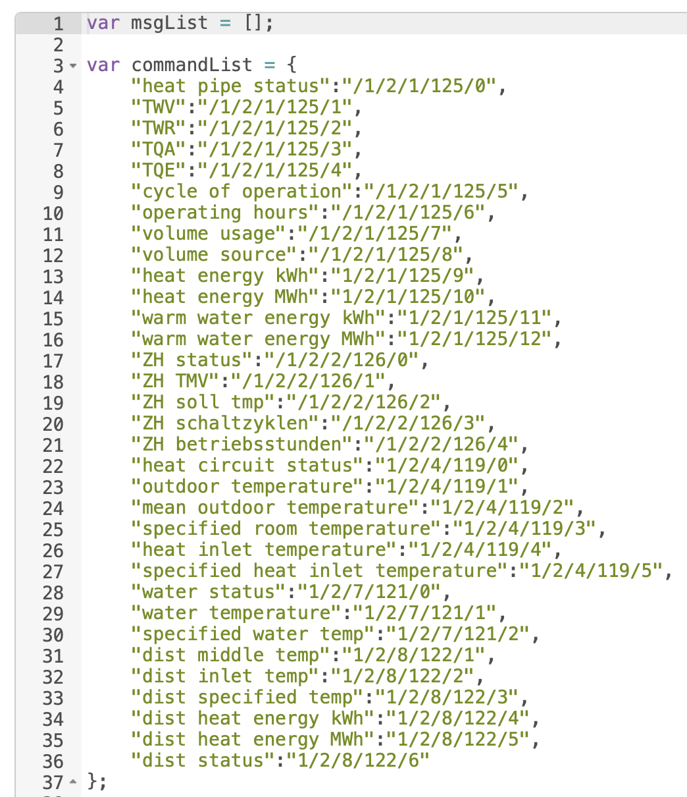
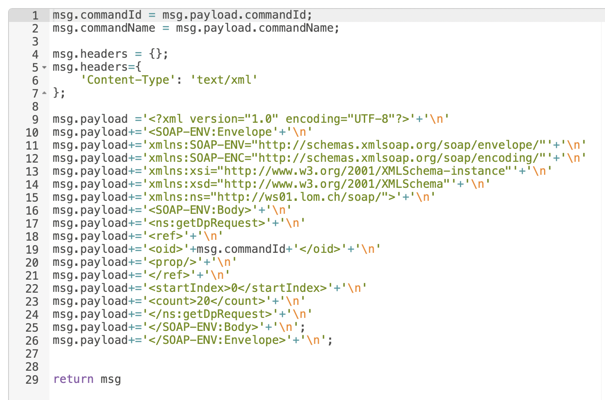
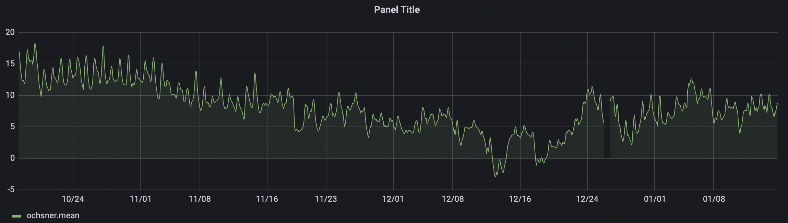

# NodeRed Ochsner DataLogger
 
## Idee
Die Betriebsdaten der Ochsner Wäremepumpe werden über das Web2com Interface ausgelesen und in einer InfluxDB gespeichert. 
Damit lassen sich dann Auswertungen mit Grafana erstellen.

## Funktionsweise
Es ist eine Parameterliste hinterlegt die Zeilenweise abgearbeitet wird.
Um den web2com Server nicht zu überlasten werden die Anfragen verzögert. 
Die Paremeter werden in eine SOAP Anfrage eingebaut und dann versendet.
Aus der Rückmeldung werden die Ergebnisdaten herausgeholt und in einer InfluxDB gespeichert.
Mittels Grafana lassen sich dann Auswertungen aus den Daten erstellen.

s